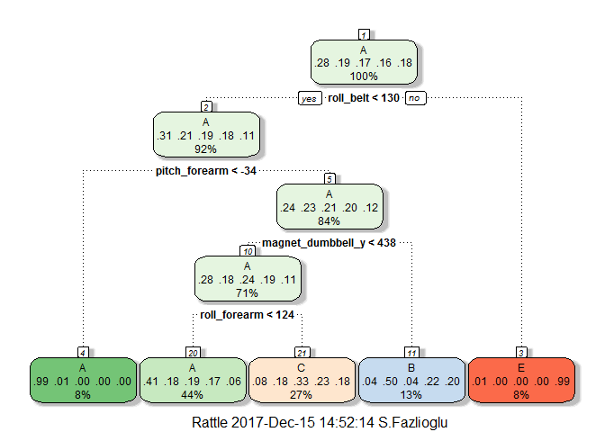
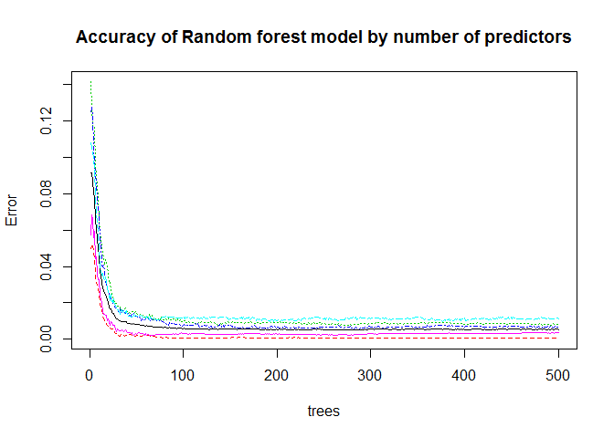
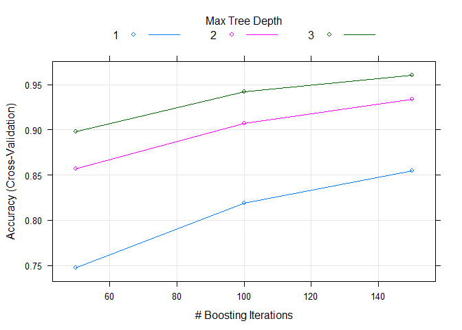

# Prediction Assignment Writeup
Seher  
December 11, 2017  
---


## Prediction Assignment Writeup

###Background

Using devices such as Jawbone Up, Nike FuelBand, and Fitbit it is now possible to collect a large amount of data about personal activity relatively inexpensively. These type of devices are part of the quantified self movement - a group of enthusiasts who take measurements about themselves regularly to improve their health, to find patterns in their behavior, or because they are tech geeks. One thing that people regularly do is quantify how much of a particular activity they do, but they rarely quantify how well they do it. In this project, your goal will be to use data from accelerometers on the belt, forearm, arm, and dumbell of 6 participants. They were asked to perform barbell lifts correctly and incorrectly in 5 different ways

### Introduction

In this project, we will be to use data from accelerometers on the belt, forearm, arm, and dumbell of 6 participant They were asked to perform barbell lifts correctly and incorrectly in 5 different ways. The five ways are exactly according to the specification (Class A), throwing the elbows to the front (Class B), lifting the dumbbell only halfway (Class C), lowering the dumbbell only halfway (Class D) and throwing the hips to the front (Class E). Only Class A corresponds to correct performance. The goal of this project is to predict the manner in which they did the exercise, i.e., Class A to E.

#### Data processing and cleaning

First, we download the data as well as necessary R packages.


```r
library(caret); library(rattle); library(rpart); library(rpart.plot)
library(randomForest); library(repmis)

training <- read.csv(url("https://d396qusza40orc.cloudfront.net/predmachlearn/pml-training.csv"),na.strings = c("NA", ""),header=TRUE)
dim(training)
```

```
## [1] 19622   160
```

```r
str(training[,1:20])
```

```
## 'data.frame':	19622 obs. of  20 variables:
##  $ X                   : int  1 2 3 4 5 6 7 8 9 10 ...
##  $ user_name           : Factor w/ 6 levels "adelmo","carlitos",..: 2 2 2 2 2 2 2 2 2 2 ...
##  $ raw_timestamp_part_1: int  1323084231 1323084231 1323084231 1323084232 1323084232 1323084232 1323084232 1323084232 1323084232 1323084232 ...
##  $ raw_timestamp_part_2: int  788290 808298 820366 120339 196328 304277 368296 440390 484323 484434 ...
##  $ cvtd_timestamp      : Factor w/ 20 levels "02/12/2011 13:32",..: 9 9 9 9 9 9 9 9 9 9 ...
##  $ new_window          : Factor w/ 2 levels "no","yes": 1 1 1 1 1 1 1 1 1 1 ...
##  $ num_window          : int  11 11 11 12 12 12 12 12 12 12 ...
##  $ roll_belt           : num  1.41 1.41 1.42 1.48 1.48 1.45 1.42 1.42 1.43 1.45 ...
##  $ pitch_belt          : num  8.07 8.07 8.07 8.05 8.07 8.06 8.09 8.13 8.16 8.17 ...
##  $ yaw_belt            : num  -94.4 -94.4 -94.4 -94.4 -94.4 -94.4 -94.4 -94.4 -94.4 -94.4 ...
##  $ total_accel_belt    : int  3 3 3 3 3 3 3 3 3 3 ...
##  $ kurtosis_roll_belt  : Factor w/ 396 levels "-0.016850","-0.021024",..: NA NA NA NA NA NA NA NA NA NA ...
##  $ kurtosis_picth_belt : Factor w/ 316 levels "-0.021887","-0.060755",..: NA NA NA NA NA NA NA NA NA NA ...
##  $ kurtosis_yaw_belt   : Factor w/ 1 level "#DIV/0!": NA NA NA NA NA NA NA NA NA NA ...
##  $ skewness_roll_belt  : Factor w/ 394 levels "-0.003095","-0.010002",..: NA NA NA NA NA NA NA NA NA NA ...
##  $ skewness_roll_belt.1: Factor w/ 337 levels "-0.005928","-0.005960",..: NA NA NA NA NA NA NA NA NA NA ...
##  $ skewness_yaw_belt   : Factor w/ 1 level "#DIV/0!": NA NA NA NA NA NA NA NA NA NA ...
##  $ max_roll_belt       : num  NA NA NA NA NA NA NA NA NA NA ...
##  $ max_picth_belt      : int  NA NA NA NA NA NA NA NA NA NA ...
##  $ max_yaw_belt        : Factor w/ 67 levels "-0.1","-0.2",..: NA NA NA NA NA NA NA NA NA NA ...
```

```r
testing <- read.csv(url("https://d396qusza40orc.cloudfront.net/predmachlearn/pml-testing.csv"),na.strings = c("NA", "") ,header=TRUE)
dim(testing)
```

```
## [1]  20 160
```

```r
str(testing[,1:20])
```

```
## 'data.frame':	20 obs. of  20 variables:
##  $ X                   : int  1 2 3 4 5 6 7 8 9 10 ...
##  $ user_name           : Factor w/ 6 levels "adelmo","carlitos",..: 6 5 5 1 4 5 5 5 2 3 ...
##  $ raw_timestamp_part_1: int  1323095002 1322673067 1322673075 1322832789 1322489635 1322673149 1322673128 1322673076 1323084240 1322837822 ...
##  $ raw_timestamp_part_2: int  868349 778725 342967 560311 814776 510661 766645 54671 916313 384285 ...
##  $ cvtd_timestamp      : Factor w/ 11 levels "02/12/2011 13:33",..: 5 10 10 1 6 11 11 10 3 2 ...
##  $ new_window          : Factor w/ 1 level "no": 1 1 1 1 1 1 1 1 1 1 ...
##  $ num_window          : int  74 431 439 194 235 504 485 440 323 664 ...
##  $ roll_belt           : num  123 1.02 0.87 125 1.35 -5.92 1.2 0.43 0.93 114 ...
##  $ pitch_belt          : num  27 4.87 1.82 -41.6 3.33 1.59 4.44 4.15 6.72 22.4 ...
##  $ yaw_belt            : num  -4.75 -88.9 -88.5 162 -88.6 -87.7 -87.3 -88.5 -93.7 -13.1 ...
##  $ total_accel_belt    : int  20 4 5 17 3 4 4 4 4 18 ...
##  $ kurtosis_roll_belt  : logi  NA NA NA NA NA NA ...
##  $ kurtosis_picth_belt : logi  NA NA NA NA NA NA ...
##  $ kurtosis_yaw_belt   : logi  NA NA NA NA NA NA ...
##  $ skewness_roll_belt  : logi  NA NA NA NA NA NA ...
##  $ skewness_roll_belt.1: logi  NA NA NA NA NA NA ...
##  $ skewness_yaw_belt   : logi  NA NA NA NA NA NA ...
##  $ max_roll_belt       : logi  NA NA NA NA NA NA ...
##  $ max_picth_belt      : logi  NA NA NA NA NA NA ...
##  $ max_yaw_belt        : logi  NA NA NA NA NA NA ...
```

The training dataset has 19622 observations and 160 variables, and the testing data set contains 20 observations along with 160 variables.Notice that many NA values and blank values appear, so we remove
them first seven variables provide information about the participants. It is quanlitive infor, we remove them, too. The goal of your project is to predict the manner in which they did the exercise. This is the "classe" variable in the training set. You may use any of the other variables to predict with. Below we do some housekeeping.


```r
training <- training[, colSums(is.na(training)) == 0]
testing <- testing[, colSums(is.na(testing)) == 0]
#We also remove the first seven predictors since these variables have little predicting power for the outcome classe.

trainData<- training[, -c(1:7)]
dim(trainData)
```

```
## [1] 19622    53
```

```r
testData <- testing[, -c(1:7)]
dim(testData)
```

```
## [1] 20 53
```

The cleaned data sets trainData and testData both have 53 columns with the same first 52 variables and the last variable classe and  problem_id individually. trainData has 19622 rows while testData has 20 rows.

In order to get out-of-sample errors, we split the cleaned training set trainData into a training set (train, 70%) for prediction and a validation set (valid 30%) to compute the out-of-sample errors.


```r
set.seed(7826) 
inTrain <- createDataPartition(trainData$classe, p = 0.7, list = FALSE)
train1 <- trainData[inTrain, ]
valid1 <- trainData[-inTrain, ]
```


### Prediction Algorithms

We use classification trees and random forests to predict the outcome.

#### Classification trees

Here we consider 5-fold cross validation while the default is 10 in order to save computing time. Secondly, we do not transform any variables.

You can also embed plots, for example:


```r
library(e1071)
control <- trainControl(method = "cv", number = 5)
fit_rpart <- train(classe ~ ., data = train1, method = "rpart", 
                   trControl = control)
print(fit_rpart, digits = 4)
```

```
## CART 
## 
## 13737 samples
##    52 predictor
##     5 classes: 'A', 'B', 'C', 'D', 'E' 
## 
## No pre-processing
## Resampling: Cross-Validated (5 fold) 
## Summary of sample sizes: 10989, 10989, 10989, 10991, 10990 
## Resampling results across tuning parameters:
## 
##   cp       Accuracy  Kappa  
##   0.03723  0.5181    0.37581
##   0.05954  0.4154    0.20866
##   0.11423  0.3488    0.09842
## 
## Accuracy was used to select the optimal model using  the largest value.
## The final value used for the model was cp = 0.03723.
```

```r
fancyRpartPlot(fit_rpart$finalModel)
```

<!-- -->

```r
# predict outcomes using validation set
predict_rpart <- predict(fit_rpart, valid1)
# Show prediction result
(conf_rpart <- confusionMatrix(valid1$classe, predict_rpart))
```

```
## Confusion Matrix and Statistics
## 
##           Reference
## Prediction    A    B    C    D    E
##          A 1544   21  107    0    2
##          B  492  391  256    0    0
##          C  474   38  514    0    0
##          D  436  175  353    0    0
##          E  155  138  293    0  496
## 
## Overall Statistics
##                                           
##                Accuracy : 0.5004          
##                  95% CI : (0.4876, 0.5133)
##     No Information Rate : 0.5269          
##     P-Value [Acc > NIR] : 1               
##                                           
##                   Kappa : 0.3464          
##  Mcnemar's Test P-Value : NA              
## 
## Statistics by Class:
## 
##                      Class: A Class: B Class: C Class: D Class: E
## Sensitivity            0.4979  0.51245  0.33749       NA  0.99598
## Specificity            0.9533  0.85396  0.88262   0.8362  0.89122
## Pos Pred Value         0.9223  0.34328  0.50097       NA  0.45841
## Neg Pred Value         0.6303  0.92162  0.79234       NA  0.99958
## Prevalence             0.5269  0.12965  0.25879   0.0000  0.08462
## Detection Rate         0.2624  0.06644  0.08734   0.0000  0.08428
## Detection Prevalence   0.2845  0.19354  0.17434   0.1638  0.18386
## Balanced Accuracy      0.7256  0.68321  0.61006       NA  0.94360
```

```r
(accuracy_rpart <- conf_rpart$overall[1])
```

```
##  Accuracy 
## 0.5004248
```

From the confusion matrix, the accuracy rate is 0.5, and so the out-of-sample error rate is 0.5. Using classification tree does not predict the outcome classe very well.


#### Random Forests


```r
library(e1071)
library(caret)
set.seed(12345)
fit_rf <- randomForest(classe ~ ., data=train1)
predictionB1 <- predict(fit_rf, valid1, type = "class")
cmrf <- confusionMatrix(predictionB1, valid1$classe)
cmrf
```

```
## Confusion Matrix and Statistics
## 
##           Reference
## Prediction    A    B    C    D    E
##          A 1671    1    0    0    0
##          B    1 1135    0    0    0
##          C    0    3 1025   11    0
##          D    0    0    1  951    3
##          E    2    0    0    2 1079
## 
## Overall Statistics
##                                           
##                Accuracy : 0.9959          
##                  95% CI : (0.9939, 0.9974)
##     No Information Rate : 0.2845          
##     P-Value [Acc > NIR] : < 2.2e-16       
##                                           
##                   Kappa : 0.9948          
##  Mcnemar's Test P-Value : NA              
## 
## Statistics by Class:
## 
##                      Class: A Class: B Class: C Class: D Class: E
## Sensitivity            0.9982   0.9965   0.9990   0.9865   0.9972
## Specificity            0.9998   0.9998   0.9971   0.9992   0.9992
## Pos Pred Value         0.9994   0.9991   0.9865   0.9958   0.9963
## Neg Pred Value         0.9993   0.9992   0.9998   0.9974   0.9994
## Prevalence             0.2845   0.1935   0.1743   0.1638   0.1839
## Detection Rate         0.2839   0.1929   0.1742   0.1616   0.1833
## Detection Prevalence   0.2841   0.1930   0.1766   0.1623   0.1840
## Balanced Accuracy      0.9990   0.9981   0.9981   0.9929   0.9982
```

```r
plot(fit_rf,main="Accuracy of Random forest model by number of predictors")
```

<!-- -->

```r
# Compute the variable importance 
MostImpVars <- varImp(fit_rf)
MostImpVars
```

```
##                        Overall
## roll_belt            871.34944
## pitch_belt           484.75240
## yaw_belt             635.70928
## total_accel_belt     156.65016
## gyros_belt_x          69.36272
## gyros_belt_y          75.82886
## gyros_belt_z         221.85953
## accel_belt_x          83.81447
## accel_belt_y          84.12766
## accel_belt_z         264.63887
## magnet_belt_x        178.05695
## magnet_belt_y        278.16343
## magnet_belt_z        287.98130
## roll_arm             208.84793
## pitch_arm            126.85447
## yaw_arm              179.45543
## total_accel_arm       68.03995
## gyros_arm_x           94.28008
## gyros_arm_y           98.55868
## gyros_arm_z           41.98742
## accel_arm_x          177.21126
## accel_arm_y          102.72793
## accel_arm_z           93.00510
## magnet_arm_x         185.62782
## magnet_arm_y         152.21470
## magnet_arm_z         135.43128
## roll_dumbbell        278.02755
## pitch_dumbbell       129.79516
## yaw_dumbbell         180.65760
## total_accel_dumbbell 181.43894
## gyros_dumbbell_x      93.55602
## gyros_dumbbell_y     186.34944
## gyros_dumbbell_z      59.34438
## accel_dumbbell_x     198.21120
## accel_dumbbell_y     283.40863
## accel_dumbbell_z     236.46634
## magnet_dumbbell_x    336.98812
## magnet_dumbbell_y    464.39993
## magnet_dumbbell_z    525.01795
## roll_forearm         412.49686
## pitch_forearm        536.21230
## yaw_forearm          117.73865
## total_accel_forearm   76.63968
## gyros_forearm_x       53.03684
## gyros_forearm_y       87.93784
## gyros_forearm_z       62.37421
## accel_forearm_x      243.04871
## accel_forearm_y       94.92351
## accel_forearm_z      168.26391
## magnet_forearm_x     146.72200
## magnet_forearm_y     151.89150
## magnet_forearm_z     199.84176
```

With random forest, we reach an accuracy of 99.3% using cross-validation with 5 steps. This is very good. But let's see what we can expect with Gradient boosting.

#### Gradient Boosting


```r
library(caret)
fit_gbm <- train(classe~., data=train1, method="gbm", trControl=control, verbose=FALSE)
```

```
## Loading required package: survival
```

```
## 
## Attaching package: 'survival'
```

```
## The following object is masked from 'package:caret':
## 
##     cluster
```

```
## Loading required package: splines
```

```
## Loading required package: parallel
```

```
## Loaded gbm 2.1.3
```

```r
print(fit_gbm)
```

```
## Stochastic Gradient Boosting 
## 
## 13737 samples
##    52 predictor
##     5 classes: 'A', 'B', 'C', 'D', 'E' 
## 
## No pre-processing
## Resampling: Cross-Validated (5 fold) 
## Summary of sample sizes: 10989, 10988, 10990, 10991, 10990 
## Resampling results across tuning parameters:
## 
##   interaction.depth  n.trees  Accuracy   Kappa    
##   1                   50      0.7472490  0.6796673
##   1                  100      0.8190263  0.7709663
##   1                  150      0.8549160  0.8164309
##   2                   50      0.8567366  0.8184726
##   2                  100      0.9073295  0.8827155
##   2                  150      0.9336095  0.9159876
##   3                   50      0.8983752  0.8713487
##   3                  100      0.9423449  0.9270376
##   3                  150      0.9606896  0.9502653
## 
## Tuning parameter 'shrinkage' was held constant at a value of 0.1
## 
## Tuning parameter 'n.minobsinnode' was held constant at a value of 10
## Accuracy was used to select the optimal model using  the largest value.
## The final values used for the model were n.trees = 150,
##  interaction.depth = 3, shrinkage = 0.1 and n.minobsinnode = 10.
```

```r
plot(fit_gbm)
```

<!-- -->

```r
trainpred <- predict(fit_gbm,newdata=valid1)

confMatGBM <- confusionMatrix(valid1$classe,trainpred)
confMatGBM$overall[1]
```

```
##  Accuracy 
## 0.9604078
```
Precision with 5 folds is 96%.

#### Conclusion

This shows that the random forest model is the best one. We use it to predict the values of classe for the test data set.


```r
(predict(fit_rf, testData))
```

```
##  1  2  3  4  5  6  7  8  9 10 11 12 13 14 15 16 17 18 19 20 
##  B  A  B  A  A  E  D  B  A  A  B  C  B  A  E  E  A  B  B  B 
## Levels: A B C D E
```

